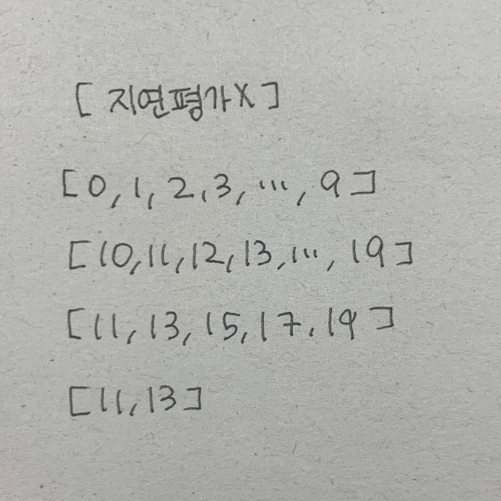
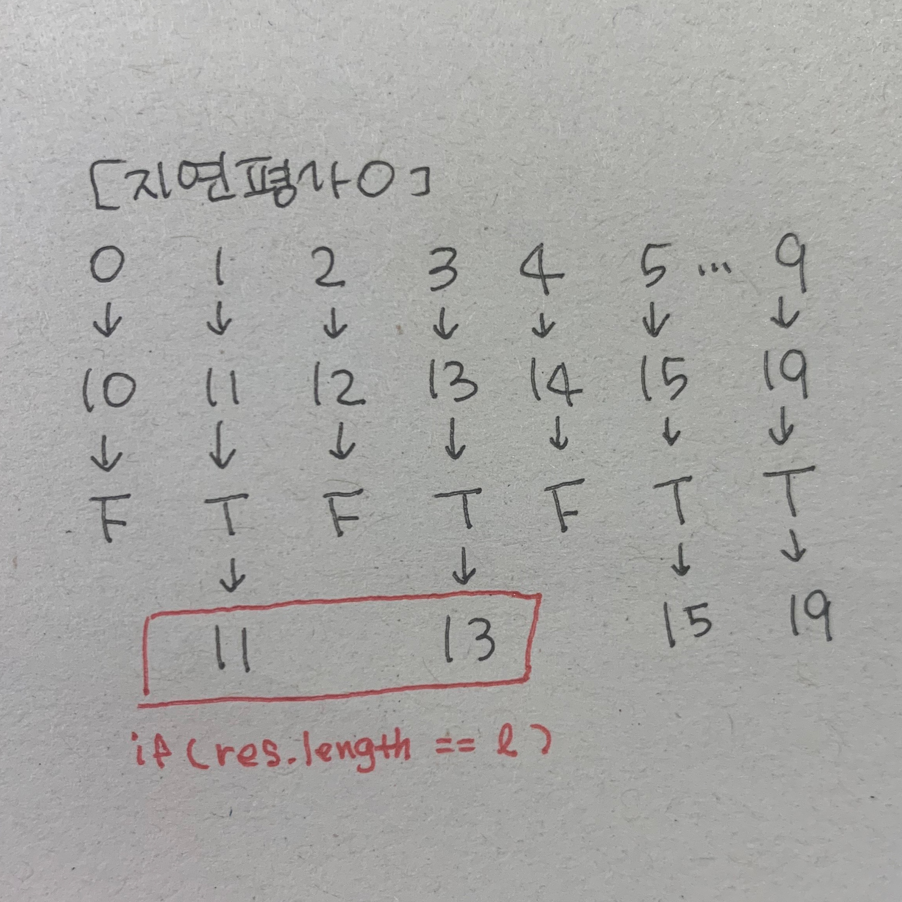

> 인프런 유인동 지식공유자님의 `함수형 프로그래밍과 JavaScript ES6+` 강의를 참고하였습니다

- 각 코드 평가 순서를 확인하고, 평가 순서가 상관없는 함수형 프로그래밍의 이점을 살펴보자.
- `for...of`문에는 숨겨진 부분이 많기 때문에 map 함수 안에서 어떤 일이 일어나는지 상세하게 보려면, 세세하게 명령형으로 작성해주어야 한다.

## range, map, filter, take, reduce 중첩 사용

```javascript
const curry =
  (f) =>
  (a, ..._) =>
    _.length ? f(a, ..._) : (..._) => f(a, ..._);

// 1. range
// l에 10이 들어오게 된다
const range = (l) => {
  // (1) l: 10
  let i = -1; // i: 0 ... i: 9
  let res = []; // res: [0] ... res: [0, 1, ..., 9]
  while (++i < l) {
    res.push(i); // i: 0 ... i: 9
  }
  return res; // [0, 1, 2, 3, ..., 9]
};

// 2. map
// f에는 n => n + 10이, iter에는 range(10)이 평가된 값인 [0, 1, 2, 3, 4, 5, 6, 7, 8, 9]가 들어오게 된다
const map = curry((f, iter) => {
  let res = []; // res: [10] ... res: [10, 11, ..., 19]
  // 이터러블을 이터레이터로 변경
  iter = iter[Symbol.iterator](); // iter = Array Iterator {}
  let cur; // {value: 0, done.false} ... {value: 9, done.false}
  while (!(cur = iter.next()).done) {
    const a = cur.value; // a: 0 ... a: 9
    res.push(f(a));
  }
  return res; // [10, 11, 12, 13, 14, 15, 16, 17, 18, 19]
});

// 3. filter
// f에는 n => n % 2가, iter에는 [10, 11, 12, 13, 14, 15, 16, 17, 18, 19]가 들어오게 된다
const filter = curry((f, iter) => {
  let res = []; // res: [11] ... res: [11, 13, 15, 17, 19]
  // 이터러블을 이터레이터로 변경
  iter = iter[Symbol.iterator](); // iter = Array Iterator {}
  let cur; // {value: 10, done.false} ... {value: 19, done.false}
  while (!(cur = iter.next()).done) {
    const a = cur.value; // a: 10 ... a: 19
    if (f(a)) res.push(a); // f(a)가 true라면 res 배열에 a를 push
  }
  return res; // [11, 13, 15, 17, 19]
});

// 4. take
// l에는 2, iter에는 [11, 13, 15, 17, 19]가 들어오게 된다
const take = curry((l, iter) => {
  let res = []; // res: [11] ... res: [11, 13]
  // 이터러블을 이터레이터로 변경
  iter = iter[Symbol.iterator](); // iter = Array Iterator {}
  let cur; // {value: 11, done.false} ... {value: 19, done.false}
  while (!(cur = iter.next()).done) {
    const a = cur.value; // a: 11 ... a: 19
    res.push(a);
    if (res.length == l) return res; //[11, 13]일 때 res길이가 2가 되어서 종료
  }
  return res; // [11, 13]
});

const reduce = curry((f, acc, iter) => {
  if (!iter) {
    iter = acc[Symbol.iterator]();
    acc = iter.next().value;
  } else {
    iter = iter[Symbol.iterator]();
  }
  let cur;
  while (!(cur = iter.next()).done) {
    const a = cur.value;
    acc = f(acc, a);
  }
  return acc;
});

const go = (...args) => reduce((a, f) => f(a), args);

// --- test ---
// 아래 코드를 실행하였을 때, range, map, filter, take 가 어떻게 동작하는지 테스트해보자
// 실행 순서: range -> map -> filter -> take -> console.log
go(
  range(10), // [0, 1, 2, 3, 4, 5, 6, 7, 8, 9]
  map((n) => n + 10), // [10, 11, 12, 13, 14, 15, 16, 17, 18, 19]
  filter((n) => n % 2), // [11, 13, 15, 17, 19]
  take(2), // [11, 13]
  console.log // [11, 13]출력
);
// [11, 13]
```

## L.range, L.map, L.filter, take, reduce 중첩 사용

```javascript
const curry =
  (f) =>
  (a, ..._) =>
    _.length ? f(a, ..._) : (..._) => f(a, ..._);

const L = {};

// 4. L.range
// l에 10이 들어오게 된다
L.range = function* (l) {
  let i = -1;
  while (++i < l) {
    yield i;
    // yield를 한 번 하게 되면(i=0), L.map에서 L.range으로 만든 이터레이터의 next()를 요청했기 때문에 L.map로 넘어가게 된다
  }
};

// 3. L.map
// f에는 n => n + 10, iter에는 L.range {<suspended>}가 들어오게 된다
L.map = function* (f, iter) {
  iter = iter[Symbol.iterator]();
  let cur; // L.range 이동하고 다시 돌아와서 {value: 0, done: false}
  while (!(cur = iter.next()).done) {
    // while문 안으로 이동할 수 없고 L.range로 이동하게 됨
    // L.range가 만든 이터레이터를 받아다 쓰기 때문
    const a = cur.value;
    yield f(a);
    // yield를 한 번 하게 되면(a=10), L.filter에서 L.map으로 만든 이터레이터의 next()를 요청했기 때문에 L.filter로 넘어가게 된다
  }
};

// 2. L.filter
// f에는 n => n % 2, iter에는 Generator {<suspended>}가 들어오게 된다
L.filter = function* (f, iter) {
  iter = iter[Symbol.iterator]();
  let cur;
  while (!(cur = iter.next()).done) {
    // while문 안으로 이동할 수 없고 L.map로 이동하게 됨
    // L.map이 만든 이터레이터를 받아다 쓰기 때문
    const a = cur.value;
    if (f(a)) {
      yield a;
      // a가 10이기 때문에 yield 되지 않고, take에 필요한 이터레이터를 위해 다시 map->range->map을 거쳐 a가 11일 때 yield 된다
      // yield된 값은 take에서 L.filter으로 만든 이터레이터의 next()를 요청했기 때문에 take로 넘어가게 된다
    }
  }
};

// 1. L.take
// 가장 먼저 실행되는 이유: 앞 3개 함수가 지연적으로 동작하기 때문
// l에는 2, iter에는 Generator {<suspended>}가 들어오게 된다
const take = curry((l, iter) => {
  let res = [];
  iter = iter[Symbol.iterator](); // Generator {<suspended>}
  let cur;
  while (!(cur = iter.next()).done) {
    // while문 안으로 이동할 수 없고 L.filter로 이동하게 됨
    // L.filter가 만든 이터레이터를 받아다 쓰기 때문
    const a = cur.value;
    res.push(a);
    // 이후 이터레이터를 전달받고 전달받은 값을 push하게 된다
    if (res.length == l) return res;
  }
  return res;
});
// well-formed 이터레이터는 본인이 이터레이터이면서, Symbol.iterator를 가지고 있고, 그것을 실행했을 때 이터레이터인 자기 자신을 리턴하게 되어 있으므로, iter = iter[Symbol.iterator]()를 지나도 여전히 이터레이터이다

const reduce = curry((f, acc, iter) => {
  if (!iter) {
    iter = acc[Symbol.iterator]();
    acc = iter.next().value;
  } else {
    iter = iter[Symbol.iterator]();
  }
  let cur;
  while (!(cur = iter.next()).done) {
    const a = cur.value;
    acc = f(acc, a);
  }
  return acc;
});

const go = (...args) => reduce((a, f) => f(a), args);

// --- test ---
// 아래 코드를 실행하였을 때, range, map, filter, take 가 어떻게 동작하는지 테스트해보자
// 실행 순서: take -> filter ->

go(
  L.range(10),
  L.map((n) => n + 10),
  L.filter((n) => n % 2),
  take(2),
  console.log
); // [11, 13]
```

- 결과는 같지만, 동작하는 방식/순서가 다르고 리턴되는 값들과 함수들이 어떤 순서로 평가되는지 차이가 있다.

### range, map, filter, take 함수



- range로 10개짜리 배열 다 만들고, map으로 10개짜리 배열 모두 10을 더하고, filter로 조건 확인하고, 그 값이 take에 들어갔다.

1. range->map "(모든 값을 얻고) 너가 map할 배열 여기 있어"
2. map->filter "(모두 map 돌리고) 너가 filter할 배열 여기 있어"
3. filter->take "(모두 filter 돌리고) 너가 take할 배열 여기 있어"

### L.range, L.map, L.filter, take 함수



- 값이 필요할 때마다 take -> L.filter -> L.map -> L.range -> L.map -> L.filter -> take 순서로 실행되게 된다.

1. take->L.filter "내가 take할 배열 줘"
2. L.filter->L.map "내가 filter할 배열 줘"
3. L.map->L.range "내가 map할 배열 줘"
4. L.range->L.map "(값이 하나 생기자마자) 너가 map할 배열 여기 있어"
5. L.map->L.filter "(하나의 값 map 돌리고) 너가 filter할 배열 여기 있어"
6. L.filter->L.take "(하나의 값 filter 돌리고) 너가 take 배열 여기 있어"

<br />
<br />

### 엄격한 계산과 느긋한 계산의 효율성 비교

#### 엄격한 계산

- range가 건네준 배열을 배열 크기만큼 map을 다 돌려 모두 yield해서 filter에게 넘겨준다.

#### 느긋한 계산

- take에서 첫 next()시 filter로 이동, filter에서 next()시 map으로 이동, map에서 next()시 range로 이동
- range에서 0 하나 yield하면, 받아서 map 돌리고 yield해서 filter에게 넘겨준다.
- 이 때, filter yield가 안되는 조건이면, take의 next()는 아직 실행되지 않은 것이 되고, 다시 range가 1을 yield -> map이 11을 yield -> filter가 11을 yield 과정이 진행된다.
- 필요할 때마다 꺼내쓰기 때문에, range가 받는 l이 무한수열이어도 성능상 차이가 없게 된다.
